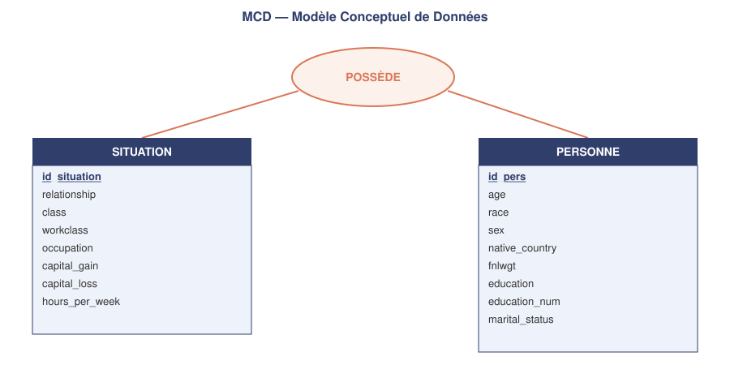
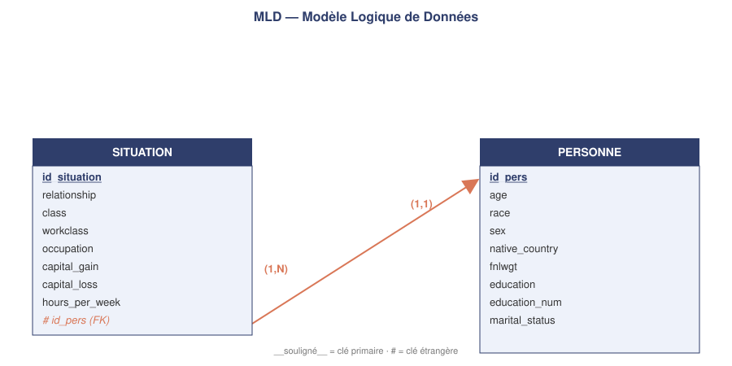
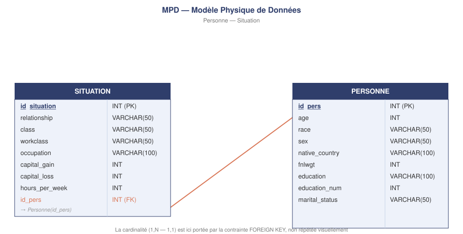

# census-income-prediction
Analyse et prédiction du revenu à partir de critères socio-démographiques sur un échantillon de population Américain.

### Etape 1 : Cadrage et premières données 

# collecte > Les données utilisées proviennent du dataset Adult Census Income, mis à disposition via la plateforme OpenML.
Pour assurer une extraction reproductible, j'ai récupéré directement le dataset dans le notebook Python à l'aide de la bibliothèque scikit-learn et de la fonction permettant de charger des datasets depuis OpenML.
Le processus est automatisé, à chaque exécution du code, les données peuvent être récupérées directement depuis la source sans téléchargement manuel préalable.
Les données sont ensuite chargées dans un DataFrame pandas afin de permettre leur exploration, leur diagnostic et leur nettoyage.

# premier diagnostic 
> pas de doublons présents
> 9 colonnes au format category dont trois avec des valeurs manquantes ('work_class", 'occupation', 'native-country'), les colonnes restantes sont au format int64
> des valeurs abbérantes potentielles sur les colonnes 'education_num' et 'hours_per_week'
> la colonne 'fnlwgt' correspond au poids statistique du profil pour une population réelle, c'est une pondération numérique pas une unité, elle permet de se rendre compte de la représentativité de l'observation dans une population de référence.
> la colonne 'education_num' provient de la variable catégorielle de la colonne 'education' sur les niveaux d'études 

|    N° | Niveau américain       | Équivalent français              |
| ----: | ---------------------- | -------------------------------- |
|     1 | Preschool              | Maternelle                       |
|   2–4 | 1st-4th → 7th-8th      | CP → 4e                          |
|   5–8 | 9th → 12th             | 3e → Terminale                   |
|     9 | HS-grad                | Fin du secondaire                |
|    10 | Some-college           | Supérieur sans diplôme           |
| 11–12 | Assoc-voc / Assoc-acdm | Bac+2                            |
|    13 | Bachelors              | Bac+3/4                          |
|    14 | Masters                | Bac+5                            |
|    15 | Prof-school            | Formation spécialisée supérieure |
|    16 | Doctorate              | Doctorat (Bac+8)                 |

> colonne 'capital_gain' et 'capital_loss' correspondent aux gains ou pertes réalisés suite à la vente d'actifs 
> la colonne 'class' identifie les personnes avec un revenu annuel inférieur ou supérieur à 50k/an
> la colonne 'work_class' identifie le type d'employeur, le secteur d'une personnne

| Valeur              | Signification                                                     |
|---------------------|-------------------------------------------------------------------|
| `Private`           | Employé du secteur privé (catégorie la plus fréquente)            |
| `Self-emp-not-inc`  | Travailleur indépendant, entreprise non incorporée                |
| `Self-emp-inc`      | Travailleur indépendant, entreprise incorporée (société)          |
| `Federal-gov`       | Employé du gouvernement fédéral                                   |
| `Local-gov`         | Employé d'une collectivité locale (ville, comté)                  |
| `State-gov`         | Employé d'une administration d'État                               |
| `Without-pay`       | Travaille sans être rémunéré (ex : entreprise familiale)          |
| `Never-worked`      | N'a jamais travaillé                                              |
| `NaN` (2 795 lignes)| Valeur manquante — non renseigné par l'individu                   |

> la colonne maritals_status comporte une variable nommée 'Married-AF_spouse' qui signifie marié(e) à un(e) membre des forces armées

> la colonne 'occupation' indique effectivement le métier 

| Occupation        | Signification                    |
| ----------------- | ------------------------------------------- |
| Prof-specialty    | Profession spécialisée / intellectuelle     |
| Craft-repair      | Artisanat, réparation et métiers techniques |
| Exec-managerial   | Cadre dirigeant / management                |
| Adm-clerical      | Administration / travail de bureau          |
| Sales             | Vente / commercial                          |
| Other-service     | Autres métiers de services                  |
| Machine-op-inspct | Opérateur de machine / contrôle             |
| Transport-moving  | Transport et manutention                    |
| Handlers-cleaners | Manutention / nettoyage                     |
| Farming-fishing   | Agriculture / pêche                         |
| Tech-support      | Support technique / informatique            |
| Protective-serv   | Services de protection / sécurité           |
| Priv-house-serv   | Services à domicile                         |
| Armed-Forces      | Forces armées                               |

> la colonne 'relationship' indique la relation de l'individu avec son foyer ou sa famille, 'other_relative' peut représenter la famille élargie, la belle famille 

> la colonne 'class' quant à elle indique l'appartenance d'une personne au groupe avec un revenu supérieur ou non à la valeur cible de 50K dollars. Il y a 37109 personnes en dessous de ce seuil pour 11681 au-dessus. Il y a en effet un déséquilibre de classe à l'origine pour les prédictions futures qu'il faudra potenliellement prendre en compte lors de l'examen de ces dernières.

# Nettoyage
Il y a effectivement trois colonnes comportant des valeur 'NaN'. Sur les colonnes 'workclass" et "occupation" notamment. En regardant de plus près ces cas (environ 3400 lignes à peu près 7%) je m'apperçois qu'il est difficile de formuler des hypothèses afin d'enrichir ces instances. De plus les supprimer pourrait par la suite entrainer un biais de séléction des algorythmes lors de la phase d'entraînement. Je décide d'ajouter une variable 'Unknown" à ces colonnes pour pallier à ça.

Concernant la variable native_country, celle-ci représente environ 850 valeurs manquantes, soit une faible proportion du dataset (1,7%). De plus la répartition de classe pour ces valeurs et à peu près du même ordre de grandeur que celle du dataset entier. Je décide supprimer ces observations afin de conserver une variable géographique exploitable sans créer de catégorie artificielle.

Je vérifie les correspondances entre les colonnes 'maritals_status' et 'relationships', à première vue il y a des anomalies de remplissage. La variables 'own-child' semble être un choix par défaut pour des cas particuliers non renseignés ou simplement des erreurs de saisie. Pour les status marritaux suivants : Married-civ-spouse, Married-spouse-absent, Separated, Divorced, Widowed je constate qu'il y a environ 1000 lignes 'relationship' indiquant own-child, soit un enfant à charge. Ces données sont incohérentes au vu du statut marrital, et faire des hypothèses pour un multitudes de cas différentes alors que ce lot ne repésente que 2% du dataset me semble par forcémment cohérent. Je décide ainsi de les supprimer.

# base de données 

En définissant le MCD, j'obtiens deux tables, "Personne" et "Situation", avec une cardinalité de 1:1 de "Situation" à "Personne" et une cardinalité de 1:N dans l'autre sens (une personne pourraît avoir plusieurs situations). Lors de l'écriture du MLD je décide de garder une cardinalité de 1:1 étant donné que ce set de données ne comporte pas de variable temporelle et ne sera pas implémenté avec d'autres par la suite. 

Ajout des contraintes et types au MDP 

