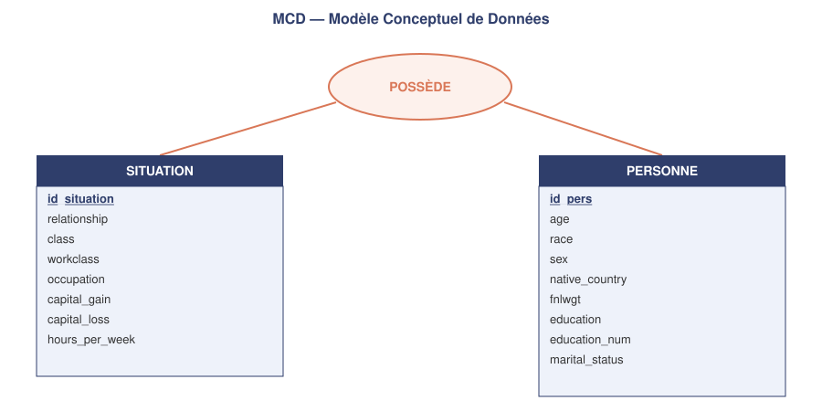
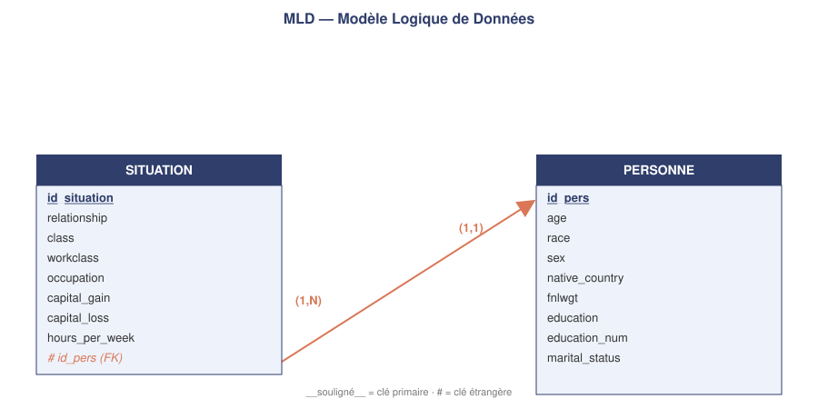
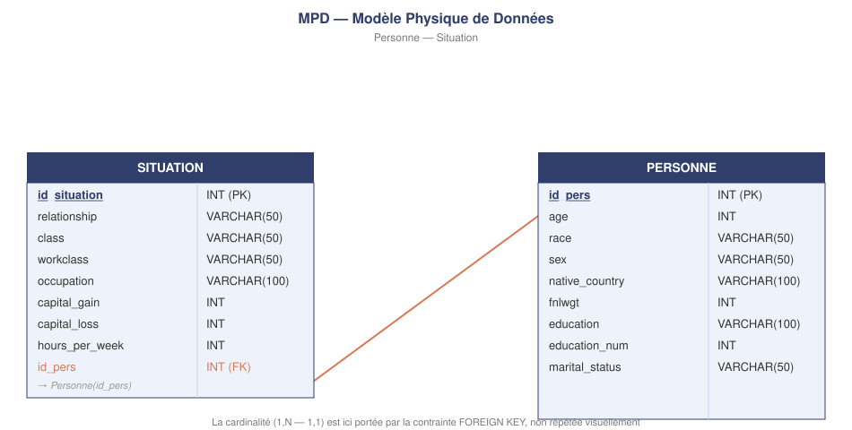

# census-income-prediction
Analyse et prédiction du revenu à partir de critères socio-démographiques sur un échantillon de population Américain.

### Etape 1 : Cadrage et premières données 

# collecte > Les données utilisées proviennent du dataset Adult Census Income, mis à disposition via la plateforme OpenML.
Pour assurer une extraction reproductible, j'ai récupéré directement le dataset dans le notebook Python à l'aide de la bibliothèque scikit-learn et de la fonction permettant de charger des datasets depuis OpenML.
Le processus est automatisé, à chaque exécution du code, les données peuvent être récupérées directement depuis la source sans téléchargement manuel préalable.
Les données sont ensuite chargées dans un DataFrame pandas afin de permettre leur exploration, leur diagnostic et leur nettoyage.

# premier diagnostic 
> pas de doublons présents
> 9 colonnes au format category dont trois avec des valeurs manquantes ('work_class", 'occupation', 'native-country'), les colonnes restantes sont au format int64
> des valeurs abbérantes potentielles sur les colonnes 'education_num' et 'hours_per_week'
> la colonne 'fnlwgt' correspond au poids statistique du profil pour une population réelle, c'est une pondération numérique pas une unité, elle permet de se rendre compte de la représentativité de l'observation dans une population de référence.
> la colonne 'education_num' provient de la variable catégorielle de la colonne 'education' sur les niveaux d'études 

|    N° | Niveau américain       | Équivalent français              |
| ----: | ---------------------- | -------------------------------- |
|     1 | Preschool              | Maternelle                       |
|   2–4 | 1st-4th → 7th-8th      | CP → 4e                          |
|   5–8 | 9th → 12th             | 3e → Terminale                   |
|     9 | HS-grad                | Fin du secondaire                |
|    10 | Some-college           | Supérieur sans diplôme           |
| 11–12 | Assoc-voc / Assoc-acdm | Bac+2                            |
|    13 | Bachelors              | Bac+3/4                          |
|    14 | Masters                | Bac+5                            |
|    15 | Prof-school            | Formation spécialisée supérieure |
|    16 | Doctorate              | Doctorat (Bac+8)                 |

> colonne 'capital_gain' et 'capital_loss' correspondent aux gains ou pertes réalisés suite à la vente d'actifs 
> la colonne 'class' identifie les personnes avec un revenu annuel inférieur ou supérieur à 50k/an
> la colonne 'work_class' identifie le type d'employeur, le secteur d'une personnne

| Valeur              | Signification                                                     |
|---------------------|-------------------------------------------------------------------|
| `Private`           | Employé du secteur privé (catégorie la plus fréquente)            |
| `Self-emp-not-inc`  | Travailleur indépendant, entreprise non incorporée                |
| `Self-emp-inc`      | Travailleur indépendant, entreprise incorporée (société)          |
| `Federal-gov`       | Employé du gouvernement fédéral                                   |
| `Local-gov`         | Employé d'une collectivité locale (ville, comté)                  |
| `State-gov`         | Employé d'une administration d'État                               |
| `Without-pay`       | Travaille sans être rémunéré (ex : entreprise familiale)          |
| `Never-worked`      | N'a jamais travaillé                                              |
| `NaN` (2 795 lignes)| Valeur manquante — non renseigné par l'individu                   |

> la colonne maritals_status comporte une variable nommée 'Married-AF_spouse' qui signifie marié(e) à un(e) membre des forces armées

> la colonne 'occupation' indique effectivement le métier 

| Occupation        | Signification                    |
| ----------------- | ------------------------------------------- |
| Prof-specialty    | Profession spécialisée / intellectuelle     |
| Craft-repair      | Artisanat, réparation et métiers techniques |
| Exec-managerial   | Cadre dirigeant / management                |
| Adm-clerical      | Administration / travail de bureau          |
| Sales             | Vente / commercial                          |
| Other-service     | Autres métiers de services                  |
| Machine-op-inspct | Opérateur de machine / contrôle             |
| Transport-moving  | Transport et manutention                    |
| Handlers-cleaners | Manutention / nettoyage                     |
| Farming-fishing   | Agriculture / pêche                         |
| Tech-support      | Support technique / informatique            |
| Protective-serv   | Services de protection / sécurité           |
| Priv-house-serv   | Services à domicile                         |
| Armed-Forces      | Forces armées                               |

> la colonne 'relationship' indique la relation de l'individu avec son foyer ou sa famille, 'other_relative' peut représenter la famille élargie, la belle famille 

> la colonne 'class' quant à elle indique l'appartenance d'une personne au groupe avec un revenu supérieur ou non à la valeur cible de 50K dollars. Il y a 37109 personnes en dessous de ce seuil pour 11681 au-dessus. Il y a en effet un déséquilibre de classe à l'origine pour les prédictions futures qu'il faudra potenliellement prendre en compte lors de l'examen de ces dernières.

# Nettoyage
Il y a effectivement trois colonnes comportant des valeur 'NaN'. Sur les colonnes 'workclass" et "occupation" notamment. En regardant de plus près ces cas (environ 3400 lignes à peu près 7%) je m'apperçois qu'il est difficile de formuler des hypothèses afin d'enrichir ces instances. De plus les supprimer pourrait par la suite entrainer un biais de séléction des algorythmes lors de la phase d'entraînement. Je décide d'ajouter une variable 'Unknown" à ces colonnes pour pallier à ça.

Concernant la variable native_country, celle-ci représente environ 850 valeurs manquantes, soit une faible proportion du dataset (1,7%). De plus la répartition de classe pour ces valeurs et à peu près du même ordre de grandeur que celle du dataset entier. Je décide supprimer ces observations afin de conserver une variable géographique exploitable sans créer de catégorie artificielle.

Je vérifie les correspondances entre les colonnes 'maritals_status' et 'relationships', à première vue il y a des anomalies de remplissage. La variables 'own-child' semble être un choix par défaut pour des cas particuliers non renseignés ou simplement des erreurs de saisie. Pour les status marritaux suivants : Married-civ-spouse, Married-spouse-absent, Separated, Divorced, Widowed je constate qu'il y a environ 1000 lignes 'relationship' indiquant own-child, soit un enfant à charge. Ces données sont incohérentes au vu du statut marrital, et faire des hypothèses pour un multitudes de cas différentes alors que ce lot ne repésente que 2% du dataset me semble par forcémment cohérent. Je décide ainsi de les supprimer.

# Base de données 

En définissant le MCD, j'obtiens deux tables, "Personne" et "Situation", avec une cardinalité de 1:1 de "Situation" à "Personne" et une cardinalité de 1:N dans l'autre sens (une personne pourraît avoir plusieurs situations). Lors de l'écriture du MLD je décide de garder une cardinalité de 1:1 étant donné que ce set de données ne comporte pas de variable temporelle et ne sera pas implémenté avec d'autres par la suite. 

Pour finir, j'ajoute les contraintes et types au MDP.

# Structuration de la base relationnelle

Je choisis pour le projet une base MySQL pour le stockage/requêtage comme celle-ci  est un sytème de gestion de base de données répandue, open source adapté à la structuration du projet.
Cela me permet de mettre en œuvre le modèle relationnel du projet, notamment les clés primaires, les clés étrangères et les jointures entre les tables personne et situation.

Par la suite, je charge les données nettoyées dans MySQL est j'automatise le process à l’aide d’un script Python qui utilise mysql-connector-python. L’extension derrière,  SQLTools de VS Code est utilisée pour interroger la base, contrôler les données chargées et exécuter les requêtes SQL. 

# Mise en place de l' APi client avec FastApi

J’ai dévellopé l'API avec FastAPI afin de créer une couche intermédiaire entre les utilisateurs ou les applications clientes et la base de données MySQL. L’API est organisée autour d’endpoints correspondant aux principales opérations CRUD , GET, POST, PUT et DELETE.

Les données reçues par l’API sont validées à l’aide de modèles Pydantic, qui permettent de contrôler les types attendus avant leur traitement. Les identifiants transmis dans les routes sont également typés, par exemple id_pers: int.

Les requêtes SQL utilisent des requêtes paramétrées avec des placeholders %s, plutôt que de construire directement les requêtes à partir des valeurs reçues. Cela permet de séparer les instructions SQL des données fournies par l’utilisateur et contribue à prévenir les injections SQL.

 L’API gère également certains cas d’erreur avec des codes HTTP adaptés, par exemple 404 lorsqu’une personne n’existe pas et 409 lorsqu’une suppression est impossible à cause d’une contrainte d’intégrité référentielle.

Ainsi, l’utilisation d’une API est préférable à un accès direct à la base car elle évite de fournir aux utilisateurs les identifiants MySQL et leur permet uniquement d’effectuer les opérations prévues par l’application. Elle centralise également la validation des données, les règles métier et la gestion des erreurs. Ainsi, le client peut manipuler les données au moyen de requêtes HTTP sans avoir à connaître la structure interne de la base ni à exécuter directement des requêtes SQL.

# Machine learning

Je décide de supprimer la colonne fnlwgt commme il s'agit ici d'un poids statistique représentatif dans la population et non d'une caractérisque à proprement parler. Je supprime également 'Education' comme 'Education_num' existe déjà.

Pour le preprocessing je décide de diviser les colonnes en trois catégories, numérique, catégorielle et capital auquelle j'applique respectivement un Standardscaler, un Onehotencoder et un MinMaxScaler.

Comme il s'agit ici d'un problème de classe je commence par utiliser un modèle de régression logistique afin de prédire au mieux la probabilité d'appartenir à la 'class' >= 50k annuel.

Pour rappel, les métirques répondent à : 

Accuracy >> Sur toutes mes prédictions combien sont correctes
Precision >> Parmis les personnes que le modèle prédit, combien gagnent vraiment + de 50K (FP)
Recall >> Parmis les personnes qui gagnent 50k ou plus, combien le modèle en détecte (FN)
F1 >> agit comme le compromis entre precison et recall

Pour ce faire je recherche des meilleurs paramètres sur le modèles afin de l'optimiser. Je choisis C en paramètres de validation croisée afin de trouver le niveau de régularisation qui généralise le mieux sur mes données et weight = balanced pour compenser l'inégalité de répartition des classes initiale. 
J'ai choisi le F1-score comme métrique d'optimisation du GridSearch car ma classe >50K est en effet minoritaire et je voulais trouver un compromis entre Precision et Recall, donc prendre en compte à la fois les faux positifs et les faux négatifs.

Les performances obtenues sur les jeux d'entraînement et de test sont très proches, ce qui ne met pas en évidence de surapprentissage. 

Les résultats obtenus sont contrastés : le modèle identifie correctement une grande partie des individus appartenant réellement à la classe >50K, recall de **85,3 %**, mais sa précision de **56,7 %** révèle un nombre important de faux positifs. Le F1-score de **68,1 %** montre ainsi que le compromis entre précision et rappel reste perfectible avec le seuil de décision de 0,5.

De plus, j'ai étudié l'effet d'une modification du seuil de décision sur les performances du modèle, en testant plusieurs valeurs : 0,4, 0,5 et 0,6. Les résultats obtenus montrent des variations relativement faibles des différentes métriques, de l'ordre de quelques centièmes.
Au regard de la problématique métier, je ne souhaite pas privilégier particulièrement la réduction des faux positifs ou des faux négatifs. J'ai donc choisi de conserver le seuil de décision standard de **0,5**.

En parallèle, la ROC-AUC de **0,9** indique que le modèle possède une bonne capacité globale à distinguer les individus >50K des individus <=50K, indépendamment d'un seuil de classification particulier.

Les performances finales du modèle sont donc évaluées à l'aide de plusieurs métriques complémentaires : l'accuracy, la précision, le rappel (recall), le ROC-AUC et le F1-score.

La régression logistique constitue ici mon premier modèle de référence.

Par la suite, à l’aide de la méthode Permutation Importance, je cherche à identifier les variables qui contribuent le plus aux prédictions du modèle. Elle consiste à mélanger aléatoirement les valeurs d’une variable, plusieurs fois, tout en gardant les autres variables inchangées. Le F1-score est recalculé après chaque permutation puis comparé au F1-score initial. Plus la diminution moyenne du F1-score est importante, plus le modèle dépend de cette variable pour réaliser ses prédictions.

| Rang | Variable         | Importance moyenne | Écart-type |
|-----:|------------------|--------------------:|-----------:|
| 1    | marital_status   |              0.1352 |     0.0049 |
| 2    | education_num    |              0.0481 |     0.0033 |
| 3    | capital_gain     |              0.0353 |     0.0017 |
| 4    | occupation       |              0.0284 |     0.0024 |
| 5    | relationship     |              0.0139 |     0.0023 |
| 6    | age              |              0.0087 |     0.0018 |
| 7    | hours_per_week   |              0.0073 |     0.0019 |
| 8    | capital_loss     |              0.0068 |     0.0004 |
| 9    | workclass        |              0.0066 |     0.0011 |
| 10   | sex              |              0.0041 |     0.0016 |
| 11   | native_country   |              0.0008 |     0.0015 |
| 12   | race             |              0.0004 |     0.0011 |

Ces résultats indiquent que ces trois premières variables ici sont celles dont la permutation entraîne la plus forte dégradation du F1-score. Elles semblent donc être les variables auxquelles ce modèle de régression logistique accorde le plus d'importance pour effectuer ses prédictions.

Après avoir établi un premier modèle de classification, j'ai choisi de comparer ses performances à celles de modèles d'ensemble basés sur des arbres, notamment le Random Forest et le Gradient Boosting. Ces modèles sont adaptés aux données tabulaires et permettent de modéliser des relations non linéaires ainsi que des interactions entre variables. Ce choix répond également à l'objectif du projet d'identifier les variables contribuant le plus aux prédictions du revenu.

| `feature_importances_`                            | Permutation Importance                            |
| ------------------------------------------------- | ------------------------------------------------- |
| Regarde **comment les arbres ont été construits** | Regarde **les conséquences sur les performances** |
| Basée sur les séparations des arbres              | Basée sur une métrique choisie                    |
| Propre aux modèles à arbres                       | Applicable à presque tous les modèles             |
| Ne mesure pas directement ton F1                  | Peut mesurer directement la baisse du **F1**      |
| Calculée à partir du modèle entraîné              | Mesurée en perturbant les données                 |

Pour le Random Forest, le GridSearchCV retient le modèle avec les hyperparamètres suivants : max_depth=None, min_samples_leaf=2, min_samples_split=2 et n_estimators=100.

Le Random Forest obtient une accuracy de 86,6 %, une précision de 77,9 %, un recall de 62,5 % et un F1-score de 69,3 %.
Par rapport à la régression logistique, le Random Forest améliore nettement l'accuracy (**86,6**% contre **80,6**%) et surtout la précision (**77,9**% contre **56,7**%). Il génère donc proportionnellement moins de faux positifs lorsqu'il prédit la classe >50K.

En revanche, son recall diminue (**62,5**% contre **85,3**%) : le Random Forest détecte une plus faible proportion des individus appartenant réellement à la classe >50K.

Finalement, son F1-score atteint 69,3 % contre 68,1 % pour la régression logistique. Le gain sur la métrique reste donc modéré : le Random Forest obtient une précision plus élevée (77,9 %) et un recall plus faible (62,5 %), tandis que la régression logistique présente le comportement inverse.

Le Random Forest obtient également une ROC-AUC de 0,91, indiquant une très bonne capacité globale à discriminer les individus appartenant aux classes >50K et <=50K, indépendamment d'un seuil de classification particulier.

Autrement dit, le ROC-AUC de 0,91 indique plutôt une très bonne capacité de discrimination, si l'on prend au hasard un individu réellement >50K et un individu réellement <=50K, le Random Forest attribuera un score >50K (de probavilité) plus élevé au premier dans environ 91 % des paires.

Ensuite, l'analyse par Permutation Importance, basée sur le F1-score, fait de nouveau ressortir marital_status comme la variable dont la permutation dégrade le plus les performances du modèle, avec une importance moyenne de **0,1074**. Elle est suivie par capital_gain à **0,0816** et education_num à **0,0777**.

On retrouve donc des variables déjà importantes pour la régression logistique, mais avec un ordre et des niveaux d'importance différents. Notamment, capital_gain passe devant education_num avec le Random Forest.

| Rang | Variable         | Importance moyenne | Écart-type |
|-----:|------------------|--------------------:|-----------:|
| 1    | marital_status   |              0.1074 |     0.0054 |
| 2    | capital_gain     |              0.0816 |     0.0039 |
| 3    | education_num    |              0.0777 |     0.0031 |
| 4    | occupation       |              0.0748 |     0.0056 |
| 5    | relationship     |              0.0686 |     0.0044 |
| 6    | age              |              0.0543 |     0.0056 |
| 7    | hours_per_week   |              0.0273 |     0.0047 |
| 8    | capital_loss     |              0.0199 |     0.0017 |
| 9    | workclass        |              0.0134 |     0.0017 |
| 10   | sex              |              0.0110 |     0.0024 |
| 11   | native_country   |              0.0016 |     0.0010 |
| 12   | race             |              0.0016 |     0.0012 |

Le Gradient Boosting obtient une accuracy de 87,5 %, une précision de 77,8 %, un recall de 67,8 % et un F1-score de 72,5 %. Par rapport au Random Forest, la précision reste quasiment identique tandis que le recall augmente de 62,5 % à 67,8 %, permettant d'identifier une proportion plus importante des individus appartenant réellement à la classe >50K. Cette amélioration se traduit par un F1-score supérieur à celui du Random Forest (72,5 % contre 69,3 %) et de la régression logistique (68,1 %).

La ROC-AUC de **0,929** indique également une très bonne capacité globale à discriminer les deux classes. Parmi les trois modèles testés, le Gradient Boosting présente ainsi les valeurs les plus élevées de F1-score, d'accuracy et de ROC-AUC sur le jeu de test, tandis que la régression logistique conserve le recall le plus élevé.

L'analyse via le permutation importance donne : 

| Rang | Variable         | Importance moyenne | Écart-type |
|-----:|------------------|--------------------:|-----------:|
| 1    | marital_status   |              0.1604 |     0.0055 |
| 2    | capital_gain     |              0.1020 |     0.0038 |
| 3    | education_num    |              0.0800 |     0.0030 |
| 4    | age              |              0.0617 |     0.0058 |
| 5    | occupation       |              0.0590 |     0.0031 |
| 6    | capital_loss     |              0.0314 |     0.0022 |
| 7    | hours_per_week   |              0.0300 |     0.0025 |
| 8    | relationship     |              0.0196 |     0.0015 |
| 9    | workclass        |              0.0100 |     0.0027 |
| 10   | sex              |              0.0052 |     0.0025 |
| 11   | native_country   |              0.0027 |     0.0018 |
| 12   | race             |             -0.0001 |     0.0015 |

Le Permutation Importance, calculée sur le F1-score, fait de nouveau ressortir marital_status comme la variable dont la permutation dégrade le plus les performances du modèle **0,1604**. Elle est suivie par capital_gain **0,1020** et education_num **0,0800**.

Ces trois variables occupent également les premières places dans le Random Forest. En revanche, le Gradient Boosting accorde davantage d'importance à age, qui passe devant occupation.
Enfin, race présente une importance moyenne légèrement négative (−0,0001), avec un écart-type de 0,0015. Cette valeur, très proche de zéro, ne permet pas de conclure que cette variable contribue significativement au F1-score du modèle.

>> Power BI 

Via querry je change le type et l'informartion de ma colonne class initialemen en texte (<=50K, >50K) pour un type nombre entier (0 ou 1)